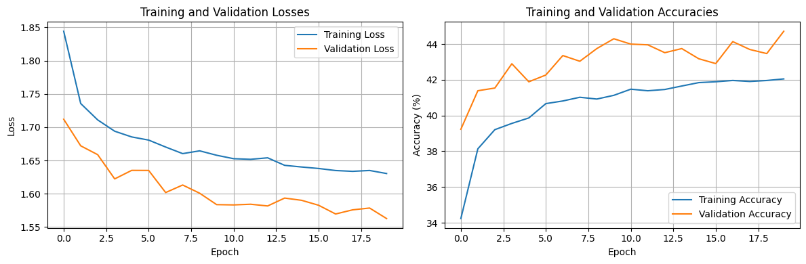

# Image Classification Model Comparison

# Image Classification Model Comparison

## Table of Contents
1. [Introduction](#introduction)
2. [Models Compared](#models-compared)
3. [Methodology](#methodology)
4. [Results](#results)
   - [Summary of Results](#summary-of-results)
   - [Training and Validation Metrics](#training-and-validation-metrics)
   - [Confusion Matrices](#confusion-matrices)
   - [Visualized Sample Predictions](#visualized-sample-predictions)
5. [Findings](#findings)
6. [Conclusion](#conclusion)
7. [License](#license)

---

## Introduction

This repository compares the performance of three different architectures for image classification: Vision Transformer (ViT), HybridCNN, and ResNet. We evaluate each model based on training and validation metrics, including loss, accuracy, precision, recall, and F1-score. Additionally, we provide confusion matrices and visualized sample predictions for each model.

## Models Compared
1. Vision Transformer (ViT)
2. HybridCNN
3. ResNet

## Methodology
Each model was trained on the CIFAR-10 dataset for 20 epochs. Hyperparameters were tuned to optimize performance for each architecture. Training times, memory usage, and inference speeds were recorded for each model. Additionally, ResNet utilized a pre-trained model and applied transfer learning techniques to adapt to the CIFAR-10 dataset.

## Results
### Summary of Results
#### Vision Transformer (ViT)
• Epochs: 20
• Final Loss: 0.871
• Memory Usage: ~2300 MB
• Training Time: ~20 minutes
• Inference Speed: Slower than HybridCNN and ResNet
• Accuracy: 0.689
• Macro Average Scores:
  - Precision: 0.688
  - Recall: 0.689
  - F1-Score: 0.686

#### HybridCNN
• Epochs: 20
• Final Loss: 0.3881
• Memory Usage: ~2200 MB
• Training Time: ~10 minutes
• Inference Speed: Faster than ViT
• Accuracy: 0.839
• Macro Average Scores:
  - Precision: 0.851
  - Recall: 0.839
  - F1-Score: 0.841

#### ResNet
• Epochs: 20
• Final Loss: 1.6304
• Memory Usage: ~2200 MB
• Training Time: ~10 minutes
• Inference Speed: Faster than ViT
• Accuracy: 0.447
• Macro Average Scores:
  - Precision: 0.446
  - Recall: 0.447
  - F1-Score: 0.442

### Training and Validation Metrics

#### Vision Transformer (ViT)

#### HybridCNN

#### ResNet

### Confusion Matrices

#### Vision Transformer (ViT)

#### HybridCNN

#### ResNet

### Visualized Sample Predictions

#### Vision Transformer (ViT)

#### HybridCNN

#### ResNet

## Findings
Among the three architectures, HybridCNN demonstrated the best performance with an accuracy of 0.839 and an F1-Score of 0.841. Its combination of convolutional feature extraction and simpler classification mechanisms offered a balance between computational efficiency and accuracy. Training took only 10 minutes, and its inference speed was faster than ViT.

Vision Transformer achieved moderate accuracy (0.689) but required 20 minutes of training and higher memory usage (2300 MB). This result highlights that while ViT can capture global relationships in images, its patch-based processing and reliance on Transformer layers make it computationally expensive.

ResNet, leveraging transfer learning, showed suboptimal performance with an accuracy of 0.447. Despite its faster inference speed, the pre-trained layers may not have effectively transferred to the relatively small CIFAR-10 dataset.

## Conclusion
The HybridCNN emerged as the most practical model for image classification, balancing performance and computational cost. While ViT demonstrates potential for tasks requiring more complex global feature understanding, it comes at a higher computational cost. ResNet, despite leveraging transfer learning, did not perform well on this specific dataset size.

## License
MIT License

Copyright (c) 2024 Syed Muhammad Mustafa

Permission is hereby granted, free of charge, to any person obtaining a copy
of this software and associated documentation files (the "Software"), to deal
in the Software without restriction, including without limitation the rights
to use, copy, modify, merge, publish, distribute, sublicense, and/or sell
copies of the Software, and to permit persons to whom the Software is
furnished to do so, subject to the following conditions:

The above copyright notice and this permission notice shall be included in all
copies or substantial portions of the Software.

THE SOFTWARE IS PROVIDED "AS IS", WITHOUT WARRANTY OF ANY KIND, EXPRESS OR
IMPLIED, INCLUDING BUT NOT LIMITED TO THE WARRANTIES OF MERCHANTABILITY,
FITNESS FOR A PARTICULAR PURPOSE AND NONINFRINGEMENT. IN NO EVENT SHALL THE
AUTHORS OR COPYRIGHT HOLDERS BE LIABLE FOR ANY CLAIM, DAMAGES OR OTHER
LIABILITY, WHETHER IN AN ACTION OF CONTRACT, TORT OR OTHERWISE, ARISING FROM,
OUT OF OR IN CONNECTION WITH THE SOFTWARE OR THE USE OR OTHER DEALINGS IN THE
SOFTWARE.